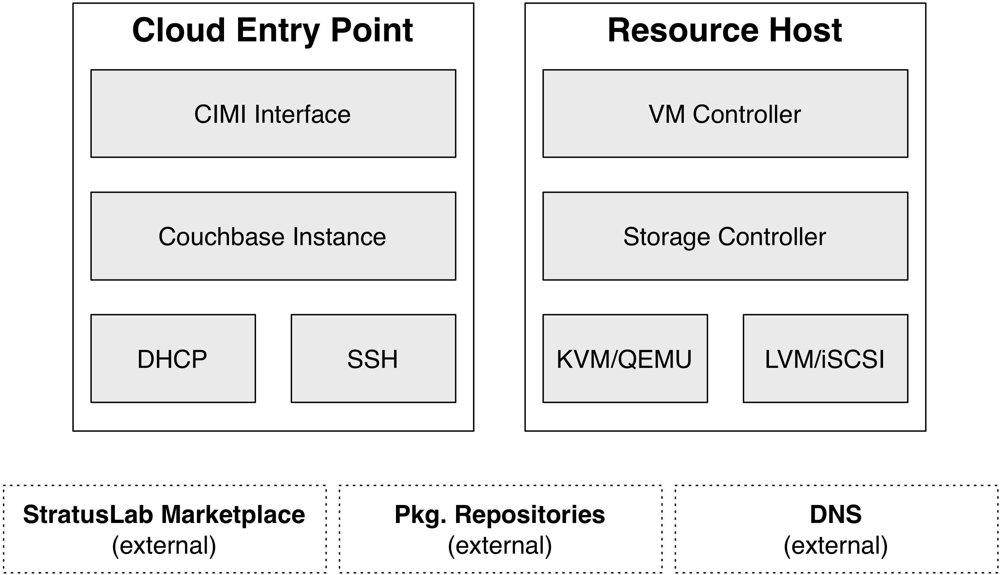

Planning the Deployment
=======================

The components of the StratusLab distribution are quite modular and
allow for a variety of different deployment layouts. This chapter
provides some advice when considering the deployment of StratusLab in
your data center.

The chapter concludes with a description of the minimal deployment of
StratusLab on two machines. This deployment serves as a good testbed for
understanding the installation process and how the cloud services work.

Your Cloud Users
----------------

When considering your deployment, you must consider who are your
intended users. The level of trust you have in those users will impact
further decisions on the network configuration, service layout, and
authentication methods.

For clouds at the "Infrastructure as a Service" level, like StratusLab,
there are generally three types of cloud deployments: private,
community, and public.

Private cloud deployments target a limited set of known and trusted
users. An example is using a cloud deployment to provide a flexible
infrastructure for an institute's services. These types of clouds are
often run by and used by the same system administrators. Because of the
high-level of trust in the users, less needs to be done to isolate cloud
services from the cloud's virtual machines.

On the other end of the spectrum are public cloud infrastructures. These
target external and possibly unknown users outside of the institute's
administrative domain. These generally require a higher level of
isolation of service and more fine-grained network segmentation.

Between the two are "community" clouds. These function like public
clouds but have a more limited set of users. A cloud infrastructure
destined for scientists at a number of collaborating institutes is a
good example of a community cloud infrastructure.

Network Configuration
---------------------

StratusLab puts very few constraints on the network configuration
supporting the cloud infrastructure. At its simplest, it can work on a
single network tying together all cloud services and resources. It can
also be made to work on complicated network configurations with multiple
VLANs, protocols, etc.

The only network constraints for StratusLab are:

-  Range of addresses to allocate to virtual machines,
-  DCHP server configured to serve those addresses, and
-  DNS configured with reverse-DNS lookups for those addresses.

The range of addresses must be IPv4 addresses, but each address can also
have an IPv6 address associated with it.

There are three different types of network traffic on a StratusLab cloud
infrastructure:

-  Control messages between the cloud services (and through the
   Couchbase database),
-  Network access to virtual machines in the cloud, and
-  Traffic between nodes hosting virtual machines and physical resources
   (e.g. storage).

The level of isolation between these different types of traffic depends
on your type of cloud deployment and your desire for a secure
infrastructure.

For a private cloud infrastructure, mixing these three types of traffic
on the same network doesn't pose any particular problem and is the
easiest to configure.

However, for a public cloud infrastructure it is a good idea to separate
the three types of traffic on separate VLANs. Even better, physical
segregation of the virtual machine traffic from the other traffic
prevents any possible compromise of the cloud services from the running
virtual machines. This is obviously more complicated to configure. You
must weight the additional complexity against the potential threats from
your users.

Mapping Services to Machines
----------------------------

There are three classes of services that need to be mapped to physical
machines: Couchbase instances, CIMI interfaces, and resource
controllers.

The usual mapping for Couchbase instances and CIMI interfaces is to
deploy these on the same physical machine. For scalability and
redundancy, two or more such physical machines are deployed.

Resource controllers are generally deployed on the same physical nodes
that provide the underlying resources. For example, the VM controller is
deployed directly on the machine(s) running the hypervisors. This
arrangement minimizes the number of physical machines that need to be
deployed.

You can alter the mapping as necessary to adapt the needs of your data
center. For example, you may have resources (like a storage appliance)
that require having the controller hosted on a different machine than
the resource it is controlling.

Minimal Deployment
------------------

The examples in this guide use a minimal deployment of two physical
machines. One machine (the "cloud entry point") contains the Couchbase
database and the CIMI interface. The other contains all of the resources
controllers and resources used for the cloud. A single network for all
traffic types is assumed for simplicity in this minimal deployment. The
following diagram summarizes this deployment.

   Minimal StratusLab Deployment

