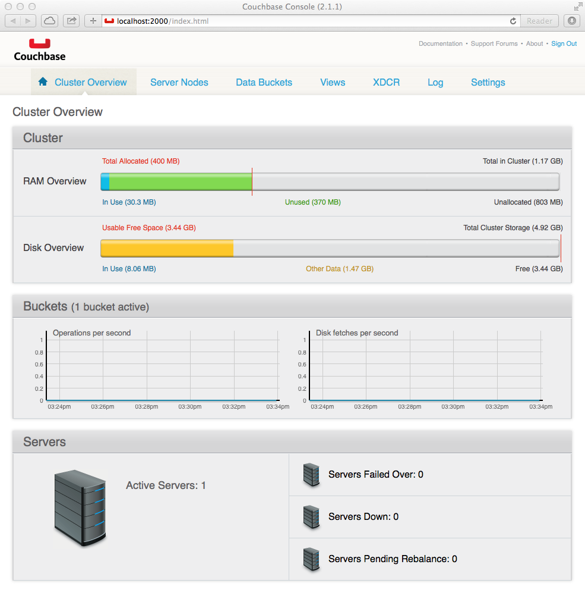

Couchbase
=========

The StratusLab architecture uses a distributed database at the core to
hold the full state of the cloud. This simplifies all of the other
components of the system by allowing them to stateless and by acting as
a means for coordinating the components of the system.

StratusLab uses `Couchbase <http://couchbase.com>`__ for this
distributed database. It was chosen because of its ability to store
and to index JSON-formatted documents efficiency, closely matching the
needs of managing cloud resources through the CIMI data model. It is
easy to deploy for small database, while retaining the ability to
scale to very large systems.

Because all other StratusLab components rely on having access to the
Couchbase database, it is the first component that must be installed.

Service Overview
----------------

Couchbase is available as a standard RPM package from the Couchbase
website. The company distributes two versions of the database:

- The **community version** is open source and released under the
  Apache 2 license (the same as for StratusLab). StratusLab uses this
  version for all of its own deployments and tests. For convenience,
  the RPM package for Couchbase is included in the StratusLab yum
  repository.

- The **enterprise version** requires the purchase of a commercial
  license for anything other than small test deployments.  The
  commercial support may be interesting for mission-critical cloud
  infrastructures. StratusLab should work with the enterprise version,
  but does not require it.  The enterprise version is not
  systematically tested by the StratusLab collaboration.

+--------------------+--------------------------------------------+
| init.d script      | couchbase-server                           |
+--------------------+--------------------------------------------+
| language           | erlang                                     |
+--------------------+--------------------------------------------+
| APIs               | Java, Python, and C                        |
+--------------------+--------------------------------------------+
| log file(s)        | /opt/couchbase/var/lib/couchbase/logs/\*   |
+--------------------+--------------------------------------------+
| initial password   | /opt/couchbase/cluster-password.txt        |
+--------------------+--------------------------------------------+
| 8091               | web administration port                    |
+--------------------+--------------------------------------------+
| 8092               | Couchbase API port                         |
+--------------------+--------------------------------------------+
| 11209\*, 11210     | internal cluster ports                     |
+--------------------+--------------------------------------------+
| 4369\*             | Erlang Port Mapper                         |
+--------------------+--------------------------------------------+
| 21100-21199\*      | Node data exchange                         |
+--------------------+--------------------------------------------+

Table: Couchbase Server Characteristics

All of the listed ports must be open to communication between the nodes
participating in the Couchbase cluster. All ports except those with an
asterisk must be open to cloud services accessing the database.

Couchbase is written in Erlang, but StratusLab uses the Java and Python
APIs to access the database. The Python API depends on the C API, so it
must also be installed.

Installation and Configuration
------------------------------

The usual service mapping puts the Couchbase instances on the "cloud
entry point" nodes, along with the CIMI interface. The instances on
these nodes form the Couchbase cluster for the full StratusLab cloud.
The minimal deployment has only one "cloud entry point" node and hence
only one Couchbase instance.

Production StratusLab deployments should have more than one Couchbase
instance in the Couchbase cluster for reliability and redundancy.
Although the default location for these instances is on the "cloud entry
point" nodes, you can deploy them on dedicated nodes or other cloud
services nodes, if needed.

The installation of Couchbase consists of installing the RPM package and
then initializing a Couchbase cluster. The StratusLab installation
commands automate the process.

Log into the node that will function as the "cloud entry point" node for
your cloud infrastructure as "root". Verify that all of the
prerequisites detailed in the previous chapter are satisfied.

Install the StratusLab system administrator command line interface
(CLI). This installs the commands that simplify and automate the
installation of all of the StratusLab components. Assuming that you have
already configured the machine for using the StratusLab yum repository
(see "Prerequisites"), this should be as simple as:

::

    $ yum install -y stratuslab-cli-sysadmin

Once this completes, you should have a set of StratusLab commands in
your path. All of the StratusLab commands start with the prefix
``stratus-``. You may want to look at the help for the
``stratus-install`` command:

::

    $ stratus-install --help

    Usage: stratus-install [options]

    Install selected services of the StratusLab cloud distribution.
    ...

This is the command that we will use to automate the installation of the
cloud services.

We will now use this command to install and initialize the Couchbase
database on the machine. Do the following:

::

    $ stratus-install --couchbase

    ...
    Starting couchbase-server       [OK]

You can get more detailed output if you add the ``-vvv`` option. This
command installs the necessary packages and then sets up the
database. The last line should indicate that Couchbase has been
started; if successful you will see an "OK" indication.

.. note::

   The installation creates an administrator account for the database
   called 'admin'. The randomly generated password for this account is
   available in ``/opt/couchbase/cluster-password.txt``.

Verification
------------

The easiest way to verify that Couchbase has been correctly installed
is to use the Couchbase web interface. This interface is available on
port 8091, but by default, is only accessible locally on the
machine. To view it remotely you will need to tunnel to the machine:

::

    $ ssh -L2000:cep.example.org:8091 -N root@cep.example.org

in a separate terminal window. You can then connect to the interface
on the "http://localhost:2000/" URL. **You must use the "admin"
account with the generated password to log in.**

If everything has been installed correctly, you should see a display
similar to the screenshot below.

   Couchbase Management Console

