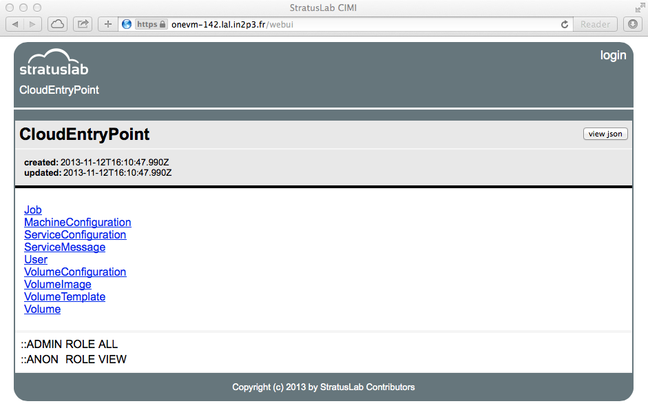
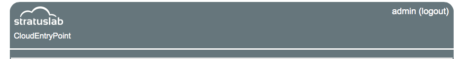
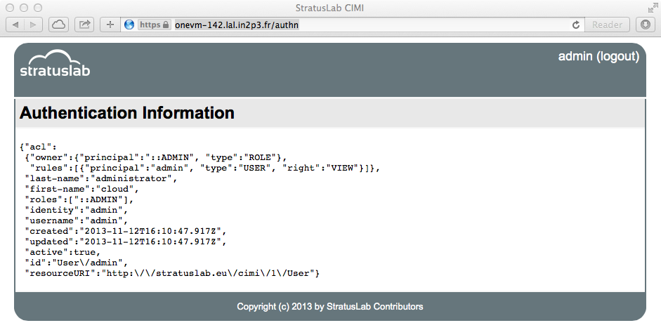

CIMI
====

StratusLab uses
`CIMI <http://dmtf.org/sites/default/files/standards/documents/DSP0263_1.0.1.pdf>`__
as its native user interface. CIMI is a standard from
`DMTF <http://dmtf.org>`__ that provides a coherent, unified, RESTful
API. The API covers all of the StratusLab cloud resources, including:

-  Virtual machines
-  Volumes for data storage
-  Machine images or appliances

In addition, StratusLab has extended the interface to provide
information to cloud users in "ServiceMessage" resources; it has also
been extended to handle resources used to configure the cloud services
and authentication mechanisms.

As the CIMI specification follows the usual REST patterns, the standard
CRUD (create, read, update, and delete) are represented by:

-  Create: HTTP POST to a resource collection URL,
-  Read: HTTP GET to a resource URL,
-  Update: HTTP PUT to a resource URL, and
-  Delete: HTTP DELETE to a resource URL.

All of the resources are represented as JSON documents and contain
metadata to allow users to understand what operations they can perform
on the resource.

Service Overview
----------------

The CIMI service is the only StratusLab service accessible by users on a
cloud infrastructure. All interactions between the user and the
underlying resources occur through this service. This service also
handles all of the user authentication for the cloud, passing verified
authentication information to the underlying services.

The characteristics of the service are summarized in the following
table. The service is the primary service on the "cloud entry point"
node(s). It runs within a dedicated Jetty web service container.

The service is written in clojure and uses the Ring and Compojure
frameworks for implementing the web service and the Friend framework for
authentication.

+--------------------+------------------------------------------+
| init.d script      | cimi                                     |
+--------------------+------------------------------------------+
| language           | clojure (lisp on the Java VM)            |
+--------------------+------------------------------------------+
| APIs               | REST, python, and libcloud               |
+--------------------+------------------------------------------+
| log file(s)        | /opt/stratuslab/cimi/logs/\*             |
+--------------------+------------------------------------------+
| initial password   | see ``cimi.log`` log file                |
+--------------------+------------------------------------------+
| 443                | port for API and web interface (HTTPS)   |
+--------------------+------------------------------------------+
| 80                 | redirects to secured port (443)          |
+--------------------+------------------------------------------+

Table: CIMI Server Characteristics

Installation
------------

As for all of the StratusLab services, the installation consists of the
installation of an RPM package followed by configuration of the service.
This process is automated via the ``stratus-install`` command.

Logged in as "root" on the "cloud entry point" machine, execute the
following command to install the CIMI service:

::

    $ stratus-install --cimi 

This should complete without error and start the cimi service. You can
check that it is running with the command:

::

    $ service cimi status

    START_INI      =  /opt/stratuslab/cimi/start.ini
    JETTY_HOME     =  /opt/stratuslab/cimi
    ...

    Jetty running pid=2099

This gives a lot of information about the service configuration and ends
with giving the PID of the running service. If this is not running, then
no PID will be given.

Configuration
-------------

Service Certificate
~~~~~~~~~~~~~~~~~~~

The first time the service starts, it will generate a self-signed
certificate for the service. This certificate will not normally be
accepted by clients (web browsers or command line interfaces) without a
security warning. While this is fine for testing, a production service
should use a certificate signed by an accepted certificate authority.

To install a certificate, create a java keystore that contains your
certificate and key using the java ``keytool`` utility. Use "jettycred"
as the password for the keystore. Put this keystore onto the machine in
the file ``/etc/stratuslab/cimi/etc/jetty.jks``. Restart the service to
make the service use the new certificate.

You can actually put the keystore anywhere on the machine and use any
password that you would like. However, if you use non-standard values,
then you will need to update the file
``/opt/stratuslab/cimi/start.d/50-ssl.ini``. This file will be
overwritten on updates, so you will need to modify this file after each
upgrade.

Trusted Certificate Authorities
~~~~~~~~~~~~~~~~~~~~~~~~~~~~~~~

By default, the installation procedure will install the set of
Certificate Authorities trusted by the European Grid Infrastructure
(EGI) as well as the Virtual Organizations (VOs) that use that
infrastructure. The files for these CAs and VOs are installed in the
``/etc/grid-security/`` directory. If these CAs are acceptable, then all
of the necessary configuration has been done for you.

    **NOTE**: Before the service will accept connections with grid
    certificates, the **certificate revocation lists (CRLs) must be
    generated**. Do this by hand, by executing the command in the
    ``/etc/cron.d/fetch-crl-cron`` file. This will generally take a few
    minutes to complete. Until the CRLs are generated, connections using
    a client certificate will fail.

If you do not want to trust these CAs and want to use the default set of
commercial CAs trusted by the java distribution, then you must modify
one of the start up files for the CIMI server. Edit the file
``/opt/stratuslab/cimi/start.d/50-ssl.ini``:

::

    #===========================================================
    # SSL Context 
    # Create the keystore and trust store for use by
    # HTTPS and SPDY
    #-----------------------------------------------------------
    jetty.keystore=etc/jetty.jks
    jetty.keystore.password=jettycred
    jetty.keymanager.password=jettycred
    jetty.truststore=etc/jetty.jks
    jetty.truststore.password=jettycred
    jetty.secure.port=443
    etc/jetty-grid-ssl.xml

Change the last line to "etc/jetty-ssl.xml" and restart the server. Note
that this configuration change will need to be reapplied for each
service upgrade.

Administrator Account
~~~~~~~~~~~~~~~~~~~~~

The details for configuring the authentication for the service are
explained in the next chapter. For now, it is enough to know that an
administrator account is created the first time the service starts. The
username is "admin"; the randomly-generated password is available in the
service log ``/etc/stratuslab/cimi/logs/cimi.log``.

Testing the CIMI Service
------------------------

The "CloudEntryPoint" resource as well as a few others are visible to
anyone, even those without an account on the cloud. We can verify that
the service is working correctly by retrieving the CloudEntryPoint.

To do this via the command line, just use ``curl`` on the base URL of
the service.

::

    $ curl -s --insecure https://cimi.example.org/ \
        python -mjson.tool

    {
        ...

        "baseURI": "https://onevm-142.lal.in2p3.fr:443/",
        "created": "2013-11-12T16:10:47.990Z",
        "id": "CloudEntryPoint",
        "jobs": {
            "href": "Job"
        },
        "machineConfigs": {
            "href": "MachineConfiguration"
        },
        "resourceURI": "http://schemas.dmtf.org/cimi/1/CloudEntryPoint",

        ...
    }

This resource (in JSON format) contains the list of all of the cloud
resource collecitons supported by this cloud infrastructure, along with
relative URLs (in the "href" field) for those resource collections. It
also contains metadata concerning the cloud infrastructure itself.

    **NOTE**: The first access to the server takes some time to respond
    because the server is dynamically compiling the source clojure files
    and initializing the database. Subsequent accesses to the service
    should be much faster.

There is also a rudimentary web browser interface provided by the
service. Point a browser at the URL http://cimi.example.org/webui,
replacing the hostname with your own. You should see an HTML
representation of the CloudEntryPoint as in the following screenshot.

   CloudEntryPoint Viewed in CIMI Web Browser Interface

Verify Administrator Account
----------------------------

You will be using the administrator account to update the service
configuration. To verify that it works, first recover the
administrator's account password from the service log. You should find a
message in the log like the following:

::

    ... User/admin entry created; initial password is 6GfRtIeWVygK

The username of this initial account is always "admin"; the "6G..."
value is the generated password. Use the value given in your log file.

To login as the administrator from the web interface, click on the
"login" link in the upper right corner, fill in the username and
password on the form, and then click the "login" button. If the login
was successful, then you should be redirected back to the
CloudEntryPoint, but you will see your login information on the right
side of the header.

   Logged in User Information

.. note::

   You can always see your full authentication information by visiting
   the URL https://cimi.example.org/authn. The most important fields
   are the "identity" field (giving your username) and the "roles"
   field (giving your authorizations).

   Full Authentication Information

If you can see pages similar to the screenshots, the administrator of
the CIMI is correctly configured. However, you will likely want to
**change the password of the administrator account**. Now that you are
logged into the server, you can do this.

Return to the CloudEntryPoint using the web browser interface (i.e. the
URL ending with "webui"). From there, click on "User". This brings up
the list of user records; only the "admin" account should be listed.
Then click on "admin" to view the user record. You should see a page
listing characteristics of the "admin" account, notably there will be a
field "password" containing the bcrypt hash of the current administrator
password.

You should see three buttons on the right of the page: "view json",
"edit", and "delete". You will want to click on the "edit" button which
will bring up a JSON editor with the current contents of the "admin"
user.

However, before doing this, you want to generate the bcrypt hash for a
new (memorable) password. This can be done with python using the
following command:

::

    $ python -c "
    > import bcrypt
    > h=bcrypt.hashpw('hello', bcrypt.gensalt())
    > print h
    > "
    $2a$12$zvS7axGrws6/YH2AuIyXpufc174KV5bjBTp.vo400sGZsehP7CpFS

You may have to install the package "py-bcrypt" on CentOS for this to
work. It returns the hash of your password. Change the 'hello' in the
example to the password you want to use.

Now that you have a new password, click on the "edit" button, change the
value of the password field to the hash value you've generated and click
on the "save" button. You should be redirected back to the same page,
but the password field will have been updated.

You can now logout via the "logout" link and log back into the service
(with your new password!) using the same procedure as before.

Service Messages
----------------

As a further example of how to use the web interface (which you will use
to handle service configuration), you can create "ServiceMessage"
resources on the server.

The ServiceMessage resources are visible to anyone but can only be
created by the administrator. These messages are intended to provide
general service information to users, like the MOTD (message of the day)
text on many operating systems.

From the CloudEntryPoint, click on the "ServiceMessage" link. This
should bring up an empty list of ServiceMessage resources. Click on the
"add" button, which will bring up the same JSON editor you saw
previously.

Add something like the following to the editor panel:

::

    {
      "name": "StratusLab is Alive!",
     "description": "Deploying StratusLab clouds is fun."
    }

and then click on the "save" button. You should then see a summary panel
of the message along with metadata that was added to the entry. You can
view JSON for the entry with the "view json" button, update it with the
"edit" button, or delete it with the "delete" button.

If you go back to the ServiceMessageCollection, you will see the entry
in the list.

For ServiceMessage resources the "name" field is treated like a title
and the "description" gives the full message.
