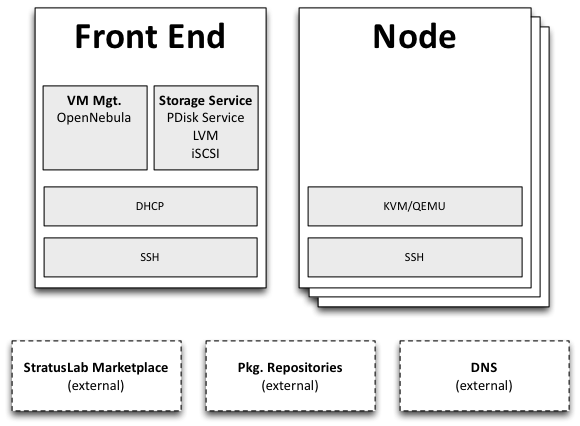

Overview
========

The StratusLab distribution provides a simple command line client to
install, configure and start the StratusLab Cloud services and
components.

The default deployment has two types of machines:

1. **Front-End** - machine for VM management and storage services
2. **Node** - machine that hosts virtual machines

A quick overview of the procedure is:

1. Ensure all prerequisites are satisfied.
2. Define all of the StratusLab service parameters.
3. Install and configure the Front End, containing the VM management
   service (OpenNebula) and the storage management (Persistent Disk)
   service.
4. Install and configure the Node(s) via SSH from the Front End. By
   default `KVM <http://www.linux-kvm.org/>`__ is used for the
   hypervisor on the Node(s).
5. Validate the installation by starting a virtual machine.

   Minimal StratusLab Cloud
