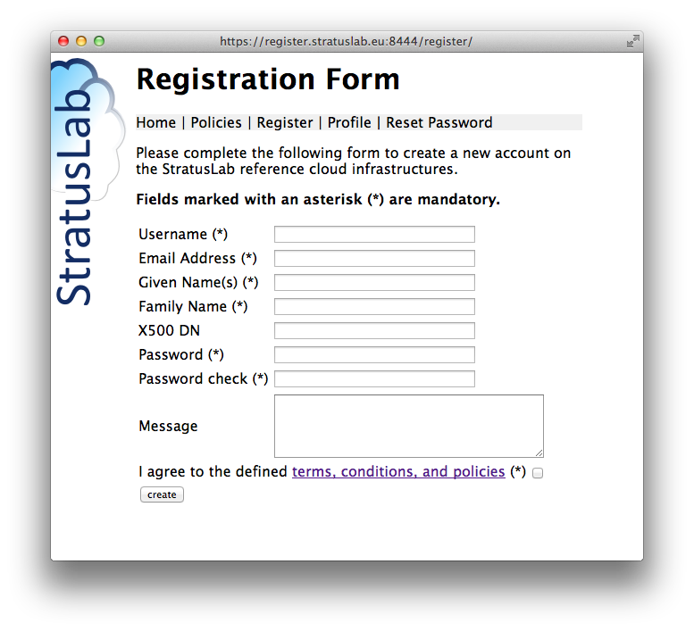

Web Interfaces
==============

Web interfaces are often more intuitive than command line interfaces.
Moreover, they do not require the installation of software on the user's
machine (aside from a web browser!).

Eventually StratusLab will provide a unified portal to allow access to
all services via a web browser, but this is not yet available.
Nevertheless, several of the StratusLab services provide a web
interface. These interfaces are essentially a thin veneer over the
services' REST interfaces.

Marketplace
-----------

For the Marketplace, the primary interface is via a web browser. This
interface allows users to search for available images, to access the
metadata in several formats (HTML, XML, and JSON), and to upload new
metadata entries.

.. figure:: images/marketplace-screenshot.png
   :alt: Marketplace Screenshot

   Marketplace Screenshot

Storage
-------

The storage service also provides a web browser interface that mirrors
the underlying REST interface. This interface allows a users to see the
complete list of disks, manage the metadata of the disks, and to mount
and dismount them from virtual machines dynamically.

.. figure:: images/storage-screenshot.png
   :alt: Storage Service Screenshot

   Storage Service Screenshot

Registration
------------

The registration service is an optional service that allows users to
register for access to a cloud infrastructure and to manage the
information associated with their account. If used, the cloud
administrator validates the account requests.

This service is indeed used for the StratusLab reference cloud
infrastructure and users may register via this `service
instance <https://register.stratuslab.eu:8444/>`__.

   Registration Screenshot
