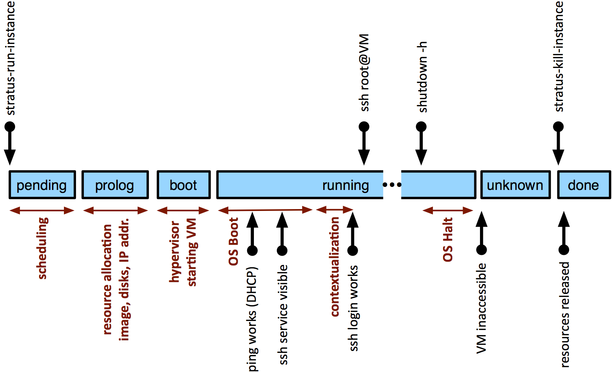

Virtual Machine Lifecycle
=========================

Managing virtual machines (VMs) is the core functionality associated
with IaaS cloud infrastructures. StratusLab is no different, providing
the commands to start and stop virtual machines. Users can define the
resources allocated to these VMs--CPUs, RAM, swap space, and volatile
disk space.

Lifecycle Overview
------------------

From the user's perspective, the VM lifecycle is rather simple. It
consists of the following steps:

1. Search the Marketplace for virtual machine image to run on the cloud.
2. Launch a machine instance via the cloud entry point using the VM
   image identifier.
3. Obtain the machine instance's network address.
4. Use and control the VM, usually for example, logging into the VM as
   root via SSH.
5. Shutdown the virtual machine and release the resources.

For the first, you need to use a web browser to select an appropriate
image. The remaining steps each correspond to a StratusLab command:

-  ``stratus-run-instance``: deploy a VM given the Marketplace
   identifier of the image
-  ``stratus-describe-instance``: find the state of all of the active
   VMs or of a single VM
-  ``stratus-connect-instance``: connect via SSH to the machine (raw SSH
   commands can also be used)
-  ``stratus-kill-instance``: stop the machine and deallocate all of its
   resources

The detailed lifecycle of a machine is more complicated. The diagram
shows the full lifecycle and describes what is happening behind the
scenes in each of these cases.

   Virtual machine timeline and states.

Manage a VM
-----------

Probably the easiest way to see how this works is to run through a
complete example. We will go through a complete lifecycle for a ttylinux
machine. The ttylinux distribution is a small linux distribution mostly
intended for embedded systems. Its small size and fast boot make it
ideal for tests.

Find the Image Identifier
~~~~~~~~~~~~~~~~~~~~~~~~~

First you would normally browse the Marketplace to find a suitable
image. You can find the images provided by StratusLab by searching for
the endorser "images@stratuslab.eu". For our case, the ttylinux image
has the identifier: "BN1EEkPiBx87\_uLj2-sdybSI-Xb".

Start a Virtual Machine
~~~~~~~~~~~~~~~~~~~~~~~

To start the virtual machine, use the ``stratus-run-instance`` command:

::

    $ export TTYLINUX_ID=BN1EEkPiBx87_uLj2-sdybSI-Xb
    $ stratus-run-instance ${TTYLINUX_ID}
     :::::::::::::::::::::::::
     :: Starting machine(s) ::
     :::::::::::::::::::::::::
     :: Starting 1 machine
     :: Machine 1 (vm ID: 165)
         Public ip: 134.158.75.201
     :: Done!

This provides the virtual machine identifier (165 in this case) and the
IP address at which the machine will be visible.

Virtual Machine Status
~~~~~~~~~~~~~~~~~~~~~~

To find the status of all active virtual machine, you can use the
``stratus-describe-instance`` command without any parameters:

::

    $ stratus-describe-instance 
    id  state     vcpu memory    cpu% host/ip                  name
    165 Running   1    0         0    vm-201.lal.stratuslab.eu one-165
    166 Pending   1    0         0    vm-202.lal.stratuslab.eu one-166

The status of a single machine can be found by giving the VM identifier:

::

    $ stratus-describe-instance 165 
    id  state     vcpu memory    cpu% host/ip                  name
    165 Running   1    131072    1    vm-201.lal.stratuslab.eu one-165

More details will be provided if you increase the verbosity of the
commands with the options ``-v``, ``-vv``, or ``-vvv``. More letters
provide increasingly more verbosity. This is especially helpful when
virtual machines fail.

Connect to the Virtual Machine
~~~~~~~~~~~~~~~~~~~~~~~~~~~~~~

You can use ``ping`` to determine when the machine becomes visible on
the network. Once it is visible (and the SSH daemon has started on the
VM), you can connect to the machine directly with SSH:

$ ssh root@vm-201.lal.stratuslab.eu # # echo $USER root #

or you can use the command ``stratus-connect-instance`` with the VM
identifier. This command is a simple wrapper around the SSH commands.

Terminating a Virtual Machine
~~~~~~~~~~~~~~~~~~~~~~~~~~~~~

To safely stop all services and halt a virtual machine, use the standard
``shutdown`` or ``halt`` commands from within the virtual machine.

::

    # shutdown -h                                                                  
    #
    Connection to vm-201.lal.stratuslab.eu closed by remote host.                
    Connection to vm-201.lal.stratuslab.eu closed.

The machine will stop and the status will eventually become an "unknown"
state.

::

    $ stratus-describe-instance 165
    id  state     vcpu memory    cpu% host/ip                  name
    165 Unknown   1    131072    0    vm-201.lal.stratuslab.eu one-165

    $ stratus-kill-instance 165
    $ 

This mechanism ensures that all resources (especially data volumes) are
shut down cleanly and released. Note that the VM resources are **not**
released until the ``stratus-kill-instance`` command is run.

You can also forcably stop and remove machine by just running the
``stratus-kill-instance`` command:

::

    $ stratus-kill-instance 166
    $ 
    $ stratus-describe-instance 166
    id  state     vcpu memory    cpu% host/ip                  name
    166 Done      1    131072    0    vm-202.lal.stratuslab.eu one-166

This is the essentially the equivalent of pulling the power cord out of
a physical machine, so be careful when doing this, especially if
persistent data volumes are attached to the virtual machine.

Virtual Machine Resources
-------------------------

You can control the number of CPUs, amount of RAM and size of the swap
space allocated to a virtual machine. StratusLab provides a number of
predefined machine cnofigurations. You can obtain a list of these with
the command:

::

    $ stratus-run-instance --list-type 
      Type              CPU        RAM       SWAP
      c1.medium       1 CPU     256 MB    1024 MB
      c1.xlarge       4 CPU    2048 MB    2048 MB
      m1.large        2 CPU     512 MB    1024 MB
    * m1.small        1 CPU     128 MB    1024 MB
      m1.xlarge       2 CPU    1024 MB    1024 MB
      t1.micro        1 CPU     128 MB     512 MB

You can select the configuration you want by using the ``--type`` option
to ``stratus-run-instance`` and providing the name of the type. The
default is the type marked with an asterisk ("m1.small").

You can also individually specify the CPU, RAM, and swap space with the
``--cpu``, ``--ram``, and ``--swap`` options. These will override the
corresponding in the value in the selected type.

Note that the maximum values are determined by the largest physical
machine in the cloud infrastructure. The cloud administrator of your
infrastructure can provide these limits.
