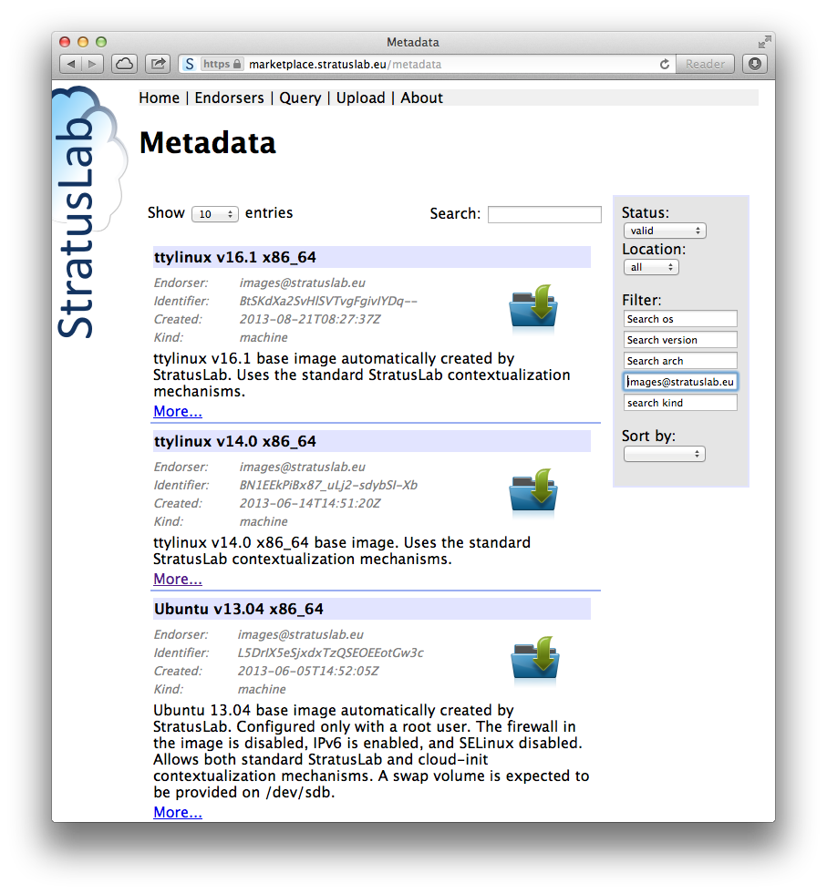

=============
User Tutorial
=============

`StratusLab <http://stratuslab.eu/>`__, an international collaboration,
provides a complete, open source cloud distribution, allowing the
installation of public or private "Infrastructure as a Service" cloud
infrastructures. It aims to be both simple to use and simple to install.

Cloud infrastructures provide many benefits to end-users (U), developers
(D), administrators (A), and resource providers (R).

+-----+-------------------------------------------------------------------+
| U   | To provide a customized execution environment                     |
+-----+-------------------------------------------------------------------+
| U   | To make available pre-installed and pre-configured applications   |
+-----+-------------------------------------------------------------------+
| U   | To provision new resources (CPU, storage, etc.) rapidly           |
+-----+-------------------------------------------------------------------+
| U   | To allow complete control of those resources                      |
+-----+-------------------------------------------------------------------+
| D   | Easy access to the services through simple APIs                   |
+-----+-------------------------------------------------------------------+
| D   | The elasticity of the cloud to respond to peaks in demand         |
+-----+-------------------------------------------------------------------+
| A   | More flexible management of machines and services                 |
+-----+-------------------------------------------------------------------+
| A   | Separation of hardware, service, platform and user services       |
+-----+-------------------------------------------------------------------+
| R   | Better utilization of shared computing resources                  |
+-----+-------------------------------------------------------------------+
| R   | Possibility of federating resources with other clouds             |
+-----+-------------------------------------------------------------------+

Table: Cloud Benefits

Services
--------

StratusLab provides the compute, storage, and network resources expected
from Infrastructure as a Service (IaaS) cloud providers. It also
provides management tools that allow trusted sharing of virtual machine
appliances, VM images with preinstalled and preconfigured applications
and services.

The **compute services** focus on fast provisioning of Virtual Machines
(VMs) and low latency start-up. They also support a variety of
contextualization mechanisms (HEPiX, OpenNebula, and CloudInit) to allow
users to create and to use parameterized appliances.
`OpenNebula <http://opennebula.org/>`__ is currently at the core of the
VM management for StratusLab.

The **storage service** provides persistent data volumes. These volumes
can be created and destroyed independently of any particular virtual
machine. They can be attached or detached either when a virtual machine
starts or dynamically after the machine is already running. Volatile and
read-only storage are also provided.

**Network connectivity** is crucial for any remote resource. Users can
select whether their machine needs a public or private IP address and
they can use the standard firewall services within the VM to further
protect the machine if necessary. StratusLab make use of standard
networking services (DHCP, DNS, etc.) that are likely already in place
at a site.

The Marketplace is the core of the **appliance handling mechanisms**. It
serves as a registry where image creators can publicize their images and
where users can find appropriate ones. Site administrators can use the
registry information to define and to enforce a policy that selects
which appliances can be run on a their cloud infrastructure.

Tools
-----

The distribution also contains tools to make accessing and using
StratusLab services easier. The client command line interface (CLI)
allows users to access all of the StratusLab resources. It is written in
portable Python and runs on all Linux distributions, Mac OS X, and
Windows.

StratusLab also provides several APIs for programmatic access to the
services. There is a set of native Python libraries (used also by the
CLI) that can be used to talk to the raw XML-RPC and REST service
interfaces. A higher-level and more stable interface is provided by the
`Libcloud <http://libcloud.apache.org/>`__ plugin for StratusLab.

Roadmap
-------

The StratusLab cloud distribution is in active development with new
releases approximately every three months. The major improvements
expected over the next few releases include:

-  **Interfaces**: CIMI REST interface as a standard for all of the
   StratusLab services and afterwards a complete, web-accessible
   interface.
-  **Simplicity, Scalability & Robustness**: Direct use of libvirt as
   the VM manager and use of Couchbase as an information bus between
   elements in the new, simplified architecture.
-  **Better Administrator Tools**: Improved overview and monitoring of
   cloud activity, fine-grained accounting, and VM migration control.

These changes will benefit both the cloud administrators and cloud
users.

Tutorial Overview
=================

This tutorial explains the major features of the StratusLab cloud
distribution. It shows how to start, access, and control virtual
machines and how to use various types of storage resources with those
virtual machines.

More advanced topics, such as creating customized images, are touched
upon, but the reader should consult the `User's
Guide <http://stratuslab.eu/documentation/>`__ for more details on how
to use those features.

Conventions
-----------

The exercises of this tutorial can be done from any Linux, Mac OS X, or
Windows machine. The examples show the commands for the Linux and Mac OS
X operating systems; the commands must be adapted appropriately for use
on Windows.

Colored text boxes in Courier font show interactions with a command line
shell.

::

    $ command
    results from the command
    ...
    possibly abbreviated

The command is preceeded by a dollar sign and possibly continued onto
multiple lines with trailing backslashes. Lines without the dollar sign
are the results of running the given command. Abbreviated output is
indicated by an ellipsis.

Service Parameters
------------------

This tutorial presumes that the StratusLab Reference Cloud at LAL is
being used. The relevant parameters for this cloud (and needed for the
client configuration) are given in the following table.

+----------------------------+-------------------------------------+
| Parameter                  | Value                               |
+============================+=====================================+
| ``marketplace_endpoint``   | https://marketplace.stratuslab.eu   |
+----------------------------+-------------------------------------+
| ``endpoint``               | cloud.lal.stratuslab.eu             |
+----------------------------+-------------------------------------+
| ``pdisk_endpoint``         | pdisk.lal.stratuslab.eu             |
+----------------------------+-------------------------------------+

You will also need to provide values for the parameters ``username`` and
``password``. These correspond to your account on the StratusLab cloud.

Prerequisites
=============

Before trying to follow this tutorial you must have:

1. An account on a StratusLab cloud infrastructure
2. The StratusLab command line client installed on your laptop or
   workstation.

Additionally, the network you are using must also allow access to the
ports used by the StratusLab services.

Registration
------------

If you are using the StratusLab Reference Cloud infrastructure, then you
can follow the procedure below. If not, you must contact the cloud
administrator for your cloud to obtain an account.

To register on the StratusLab Reference infrastructure, go to the
`registration page <https://register.stratuslab.eu:8444>`__. Click on
the "register" link and you should see a page like the one in the
screenshot.

.. figure:: images/registration-screenshot.png
   :alt: Marketplace Screenshot

   Marketplace Screenshot

For user authentication, either a username/password pair or an
`IGTF <http://www.igtf.net/>`__ accredited digital certificate can be
used. For the purposes of this tutorial the username/password is easier.
Ignore the optional X500 field that is needed only when using a digital
certificate.

Fill in the form, agree to the terms and conditions, and then click the
"create" button. Although not mandatory, it is useful to provide a short
message describing your use of the cloud, the scientific/engineering
domain of your application, and your institute (if any).

You will receive an email when your account has been approved by the
administrator.

Client Prerequisites
--------------------

Before starting, you must verify that the prerequisites for the
StratusLab command line are satisfied:

-  **Python 2** (2.6+), **virtualenv** and **pip** are installed.
-  **Java 1.6** or later is installed.
-  An **SSH client** is installed with an **SSH key pair**.

More information on checking and installing these dependencies can be
found in the complete `User's
Guide <http://stratuslab.eu/release/13.05.0/users-guide/users-guide.html>`__.

Network
-------

The network that you are using must allow you to contact the StratusLab
services. This requires that the ports in the following table are open
for outbound access.

+--------+------------------------+
| Port   | Service                |
+========+========================+
| 80     | http (web)             |
+--------+------------------------+
| 443    | https (secure web)     |
+--------+------------------------+
| 2634   | OpenNebula Proxy       |
+--------+------------------------+
| 8444   | Registration Service   |
+--------+------------------------+
| 8445   | Storage Service        |
+--------+------------------------+

Command Line Client
===================

The tutorial will use both a web browser and the StratusLab command line
client to access the cloud resources. The following describes how to
install and configure the command line client.

See the full `User's
Guide <http://stratuslab.eu/release/13.05.0/users-guide/users-guide.html>`__
if more details are needed or you run into problems.

Client Installation
-------------------

First create a virtual environment to hold the StratusLab client and its
dependencies.

::

    $ virtualenv $HOME/env/SL
    New python executable in /home/sluser/env/SL/bin/python
    Installing setuptools............done.
    Installing pip...............done.

You may want to choose a different name or location for your virtual
environment.

Now you will need to activate that environment.

::

    $ source $HOME/env/SL/bin/activate 
    (SL)$ 

The prompt should change to include the name of the virtual environment.

Now use pip to install the StratusLab client:

::

    (SL)$ pip install stratuslab-client 
    Downloading/unpacking stratuslab-client
      Downloading stratuslab-client-13.05.0.RC1.tar.gz (1.2MB): 1.2MB downloaded
    ...
    Successfully installed stratuslab-client dirq ...
    Cleaning up...

You can verify that the client is installed and accessible with by
searching for one of the StratusLab commands:

::

    (SL)$ which stratus-copy-config 
    ~/env/SL/bin/stratus-copy-config

All of the StratusLab commands begin with ``stratus-``. On systems that
support it, you can use tab completion to see all of the available
commands.

Client Configuration
--------------------

Now that the StratusLab client is installed, it needs to be configured.
You will need to have your credentials and the cloud service endpoints
available.

Copy the reference configuration file into place and verify it is
present:

::

    (SL)$ stratus-copy-config 

    (SL)$ ls $HOME/.stratuslab/
    stratuslab-user.cfg

This configuration file contains descriptions of all of the parameters
that can be set. There are only three or four that must be set.

Set the service endpoints for the cloud entry point and the storage
(pdisk):

::

    endpoint = cloud.lal.stratuslab.eu
    pdisk_endpoint = pdisk.lal.stratuslab.eu

substituting the values for your cloud infrastructure. (These are the
values for the StratusLab reference cloud infrastructure at LAL.) Also
set the values for your username and password:

::

    username = your.username
    password = your.password

again substituting your values for these parameters.

You can now see if you have any running machines on the cloud to test if
the client is correctly installed:

::

    (SL)$ stratus-describe-instance 
    id  state     vcpu memory    cpu% host/ip                 name
    (SL)$ 

This should return an empty list of machines. If it returns any errors,
then you'll need to correct whatever went wrong in the installation. See
the more detailed documentation.

Virtual Machine Lifecycle
=========================

This chapter descibes how to launch, to describe, to access, and to
terminate a Virtual Machine on a StratusLab cloud.

Lifecycle States
----------------

The following table summarizes the simplified Virtual Machine lifecycle
and associated commands.

+-------------+-------------------------------------------+
| State       | Command                                   |
+=============+===========================================+
| Deploy      | ``stratus-run-instance Marketplace_ID``   |
+-------------+-------------------------------------------+
| Describe    | ``stratus-describe-instance VM_ID``       |
+-------------+-------------------------------------------+
| Connect     | ``ssh root@134.158.75.xxx`` *or*          |
+-------------+-------------------------------------------+
|             | ``stratus-connect-instance VM_ID``        |
+-------------+-------------------------------------------+
| Terminate   | ``stratus-kill-instance VM_ID``           |
+-------------+-------------------------------------------+

The detailed lifecycle of a machine is more complicated. The diagram
shows the full lifecycle and describes what is happening behind the
scenes in each of these cases.

.. figure:: images/vm-timeline.png
   :alt: Virtual machine timeline and states.

   Virtual machine timeline and states.

The rest of this chapter shows how to run a VM through these states. We
will use a simple **ttylinux** appliance. This is a minimal Linux
operating system used normally for embedded systems. It is small and
boots quickly, making it a good choice for demonstrations like this.

The Marketplace identifier for the ttylinux machine is:

::

    BtSKdXa2SvHlSVTvgFgivIYDq--

You will need this when launching the ttylinux VM. We will explain where
this identifier comes from in the Marketplace chapter.

We will need this often in the tutorial. To avoid typing it all of the
time, let's set up a variable:

::

    $ export TTYLINUX="BtSKdXa2SvHlSVTvgFgivIYDq--"

Any place you see $TTYLINUX in the commands, it refers to this machine
identifier.

Deploy
------

Launch an instance of the ttylinux appliance with the
``stratus-run-instance`` command:

::

    $ stratus-run-instance $TTYLINUX

      :::::::::::::::::::::::::
      :: Starting machine(s) ::
      :::::::::::::::::::::::::
      :: Starting 1 machine
      :: Machine 1 (vm ID: 5508)
             Public ip: 134.158.75.75
      :: Done!

Response should give the VM ID and Public IP address of the VM.

All of the StratusLab commands support the ``--help`` option, which will
give detailed information about the command and its options.

Describe
--------

List all active machines:

::

    $ stratus-describe-instance
    id   state     vcpu memory    cpu% host/ip                  name
    5507 Running   1    0         0    vm-201.lal.stratuslab.eu one-5507
    5508 Pending   1    0         0    vm-202.lal.stratuslab.eu one-5508

State of a single machine:

::

    $ stratus-describe-instance 5508
    id   state     vcpu memory    cpu% host/ip                  name
    5508 Prolog    1    0         0    vm-202.lal.stratuslab.eu one-5507

Connect
-------

VM states change as the cloud intializes the virtual machines. The
following table describes the common states.

+-----------+----------------------------------------------------------+
| State     | Description                                              |
+===========+==========================================================+
| Prolog    | cloud initialization of VM (e.g. copy and cache image)   |
+-----------+----------------------------------------------------------+
| Boot      | starting virtual machine from the image                  |
+-----------+----------------------------------------------------------+
| Running   | machine is active, booting the operating system          |
+-----------+----------------------------------------------------------+
| Failed    | problem with starting/running the machine                |
+-----------+----------------------------------------------------------+
| Unknown   | machine is stopped, but still has resources allocated!   |
+-----------+----------------------------------------------------------+

Table: Common VM States

Check the VM is running:

::

    $ stratus-describe-instance 5508
    id   state     vcpu memory    cpu% host/ip                 name
    5508 Running   1    131072    4    vm-202.lal.stratuslab.eu one-5508

Ping the VM to see when it is accessible:

::

     $ ping vm-202.lal.stratuslab.eu
     PING vm-202.lal.stratuslab.eu (134.158.75.202): 56 data bytes
     Request timeout for icmp_seq 0
     64 bytes from 134.158.75.202: icmp_seq=1 ttl=63 time=0.876 ms
     64 bytes from 134.158.75.202: icmp_seq=2 ttl=63 time=0.761 ms
     ...

Connect to the VM as root:

::

    $ ssh root@vm-202.lal.stratuslab.eu
    # uname -a
    Linux ttylinux_host 3.7.1 #1 SMP PREEMPT Mon May 27 13:16:10 MST 2013 x86_64 GNU/Linux
    # logout
    Connection to vm-202.lal.stratuslab.eu closed.
    $

You can also use the ``stratus-connect-instance`` command.

::

    $ stratus-connect-instance 5508
    # uname -a
    Linux ttylinux_host 3.7.1 #1 SMP PREEMPT Mon May 27 13:16:10 MST 2013 x86_64 GNU/Linux
    # logout
    Connection to vm-202.lal.stratuslab.eu closed.
    $

It just wraps the usual ``ssh`` command and saves you from having to
look up the hostname.

Terminate
---------

To safely stop all services and halt a virtual machine, use the standard
``shutdown`` or ``halt`` commands from within the virtual machine.

::

    # shutdown -h
    #
    Connection to vm-202.lal.stratuslab.eu closed by remote host.
    Connection to vm-202.lal.stratuslab.eu closed.

The machine will stop and the state will eventually become "unknown".

::

    $ stratus-describe-instance 5508
    id   state     vcpu memory    cpu% host/ip                  name
    5508 Unknown   1    131072    0    vm-202.lal.stratuslab.eu one-5508

This mechanism ensures that all services are shutdown cleanly and that
data volumes are unmounted.

You can then release the machine's resource with the
``stratus-kill-instance`` command.

::

    $ stratus-kill-instance 5508
    $
    $ stratus-describe-instance 5508
    id   state     vcpu memory    cpu% host/ip                  name
    5508 Done      1    131072    0    vm-202.lal.stratuslab.eu one-5508

Note that the VM resources are **not released** until the
``stratus-kill-instance`` command is run. In particular, data volumes
will remain allocated to this VM until this command is run.

The ``stratus-kill-instance`` command can also be used for a running
machine. In this case, it will **forcibly stop and remove the machine**;
this can be useful if you cannot access the VM for some reason. Be
careful when doing this, especially if persistent data volumes are
attached to the virtual machine.

Virtual Machine Resources
=========================

You can control the number of CPUs, amount of RAM and size of the swap
space allocated to a virtual machine.

Predefined Machine Types
------------------------

StratusLab provides a number of predefined machine configurations. You
can obtain a list of these with the command:

::

    $ stratus-run-instance --list-type
      Type              CPU        RAM       SWAP
      c1.medium       1 CPU     256 MB    1024 MB
      c1.xlarge       4 CPU    2048 MB    2048 MB
      m1.large        2 CPU     512 MB    1024 MB
    * m1.small        1 CPU     128 MB    1024 MB
      m1.xlarge       2 CPU    1024 MB    1024 MB
      t1.micro        1 CPU     128 MB     512 MB

You can select the configuration you want by using the ``--type`` option
of ``stratus-run-instance`` and providing the name of the type. The
default is the type marked with an asterisk ("m1.small").

If the predefined types do not match your needs, you can also
individually specify the CPU, RAM, and swap space with the ``--cpu``,
``--ram``, and ``--swap`` options. These will override the corresponding
values in the implicitly or explicitly selected type.

Note that the maximum values are determined by the largest physical
machine in the cloud infrastructure. The cloud administrator of your
infrastructure can provide these limits.

For the StratusLab infrastructure at LAL, you can also view the state of
the physical machines and see the available resources. Use a web browser
or ``curl`` to see the contents of the status page:

::

    $ curl http://cloud.lal.stratuslab.eu/load/load.txt
    2013-08-28T09:40:01+0000
       ID   RVM   TCPU   ACPU   TMEM   FMEM   AMEM   STAT
      29      2   2400   2100  35.3G  28.4G  32.8G     on
      30      0      0    100     0K     0K     0K    err
      31      2   2400   2100  35.3G  31.8G  29.2G     on
      32      2   2400   2200  35.3G  32.2G  32.3G     on
      33      2   2400   2100  35.3G    31G  29.8G     on
      34      2   2400   2000  35.3G  34.6G  33.3G     on
      35      3   2400   2000  35.3G  33.8G  31.3G     on
      36      3   2400   2000  35.3G  32.7G  32.7G     on
      37      3   2400   1500  35.3G  23.5G  17.8G     on
      38      0      0    100     0K     0K     0K    err
      39      3   3200   2000  62.9G  23.4G  23.9G     on
      40      3   3200   2700  62.9G  56.6G  54.4G     on
      41      3   3200   2700  62.9G  61.1G  60.7G     on
      42      4   3200    200  62.9G  56.2G 968.4M     on
      43      4   3200      0  62.9G  50.3G   2.1G     on
      44      2   3200      0  62.9G  45.6G  17.8G     on
      45      2   3200      0  62.9G  16.9G  17.8G     on

The interesting values are probably the TCPU and ACPU (total and
available CPUs x 100) and TMEM and AMEM (total and available RAM).

Deploy VM with Machine Type
---------------------------

Deploy a VM of type "m1.xlarge"

::

    $ stratus-run-instance \
        --quiet --type=m1.xlarge $TTYLINUX
    5509, 134.158.75.203

Looking at the status of the machine:

::

    $ stratus-describe-instance 5509
    id   state     vcpu memory    cpu% host/ip                  name
    5509 Running   4    8388608   5    vm-203.lal.stratuslab.eu one-5509

will give you the allocated CPUs (vcpu) and memory. The swap space can
be seen from within the machine. **These values are provided by a
monitoring process on the physical machines and may take a couple of
minutes to be updated.**

Note that ttylinux resides entirely in memory and doesn't use swap
space!

Deploy VM with Customized Resources
-----------------------------------

Try deploying a machine with customized resources. You can use one or
more of the options ``--type``, ``--cpu``, ``--ram``, and ``--swap``:

::

    $ stratus-run-instance \
        --quiet --cpu=3 --ram=6000 --swap=2000 $TTYLINUX
    5510, 134.158.75.204

Again use the status of the VM to see what resources were allocated:

::

    $ stratus-describe-instance 5510
    id   state     vcpu memory    cpu% host/ip                  name
    5510 Running   3    6144000   5    vm-204.lal.stratuslab.eu one-5510

Note that the memory value for the status is given in KiB.

Marketplace
===========

Building new virtual machine appliances can be a tedious and
time-consuming task. Your first instinct should be to first look in the
Marketplace to see if someone else has done the work for you!

Appliance Registry
------------------

The StratusLab Marketplace provides a registry for available, public
virtual machine appliances. These are created by the people within the
community as well as by StratusLab developers to help people get started
using the cloud quickly.

Use a browser to view the Marketplace at:

::

    https://marketplace.stratuslab.eu

This contains all of the public images that are currently available.

Each appliance entry contains the basic information along with a link to
see more detailed information. **The machine identifier is the most
important piece of information.** Just providing it to the
``stratus-run-instance`` command is enough to launch an instance of that
appliance.

Base Appliances
---------------

The StratusLab developers provide "base" appliances for ttylinux, CentOS
(a RedHat Enterprise Linux derivative), Ubuntu, Debian, and OpenSuSE.
These are minimal, but functional, installations of these operating
systems. They can be used directly or customized to create personalized
machines. These can be found by typing "images@stratuslab.eu" for the
endorser in the "Filter" boxes on the right side of the Marketplace
page. (See the screenshot.)

   StratusLab Base Appliances

You can also use the filters, for example on the operating system, to
further refine the list.

Customized Appliances
---------------------

Although not covered in this tutorial, you can also create and register
your own appliances to share with others. For example, the European
project IGE has prepared appliances for testing Globus services and for
running their tutorials with the services. IBCP in Lyon has created
appliances with numerous bioinformatics applications already installed.

Search the Marketplace to find all of the appliances endorsed by
StratusLab. Also search for other appliances that might be interesting
to you.

Storage
=======

StratusLab provides three different types of storage: volatile, static,
and persistent volumes.

Volatile Storage
----------------

Volatile storage consists of a volume that is allocated when a virtual
machine starts and that is destroyed automatically when the VM
terminates. Because of the volatile nature of these volumes, they are
ideal for **temporary** storage.

Requesting a Volatile Disk
~~~~~~~~~~~~~~~~~~~~~~~~~~

Users can request a volatile disk when starting a virtual machine with
the ``--volatile-disk`` option to ``stratus-run-instance``, giving the
required size of the disk in Gigabytes.

::

    $ stratus-run-instance \
        --volatile-disk SIZE_GB $TTYLINUX

The created storage is a raw, unformatted volume. To find the disk, you
can use the command ``fdisk -l``.

Use of volatile disk
~~~~~~~~~~~~~~~~~~~~

These volatile disks are raw devices, so the user is responsible for
partitioning and/or formatting the volumes before using them. They also
must be subsequently mounted on the VM's file system.

Connect to your VM. Format, mount, and use your disk:

1. Disks are not formatted! Use: ``mkfs.ext4 /dev/xxx``
2. Mount disk: ``mount /dev/xxx /mnt/volatile``
3. Use normally: ``touch /mnt/volatile/mydata``

If you're planning on rebooting the machine, you may want to add the
volume to the ``/etc/fstab`` file so that it is mounted automatically.

Data on a Volatile Disk
~~~~~~~~~~~~~~~~~~~~~~~

Volatile disks are appropriate **only for temporary data storage**. The
data on these volumes will be destroyed when the virtual machine is
terminated. For VM reboots however, the disk and data will survive.

Verify this for yourself:

1. Reboot your VM, and verify that your disk still exists, also verify
   your data on the disk.
2. Terminate your VM. This will also destroy your disk.

Finally, note that this storage is allocated on the physical machine
where the VM is running, so requesting a very large volatile disk may
reduce the number of physical machines which can host the virtual
machine.

Static Disk
-----------

Many scientific and engineering applications require access to fixed (or
slowly changing) data sets. These data sets include versioned copies of
databases (e.g. protein databases) or calibration information. These are
often inputs to calculations that analyze larger, more varied data sets.

Read-only (static) disks allow users to create a fixed disk image
containing the data. It is then registered in the Marketplace and can
subsequently be attached to multiple machine instances. This mechanism
takes advantage of the caching and snapshotting infrastructure used for
machine images. Making the initial copy of the data image and subsequent
snapshotting for individual machine instances completely transparent to
the user.

In this tutorial we will be using "Flora and Fauna" read-only disk from
the Marketplace. The identifier is:

::

    GPAUQFkojP5dMQJNdJ4qD_62mCo

This disk contains a hierarchy of files named after plants and animals.

Run VM with Static (Read-Only) Disk
~~~~~~~~~~~~~~~~~~~~~~~~~~~~~~~~~~~

Using the image itself should be straight-forward. Use
``stratus-run-instance`` as you normally would but add the
``--readonly-disk`` option with the Marketplace identifier of the data
image. An example is:

::

    $ stratus-run-instance \
        --readonly-disk=GPAUQFkojP5dMQJNdJ4qD_62mCo \
        $TTYLINUX

This disk image is a standard image ("Flora and Fauna") used for tests
of the system. It contains a hierarchy of files named after animals and
plants. For the appliance, you can use any linux appliance.

Disks appear exactly as in reference image, formatting included. You can
use the command ``blkid`` to find the image. For this instance, the
output looks like the following:

::

    $ blkid
    /dev/sda1: UUID="2fb85561-3fc4-4258-b3cf-abd8ae53d18a" TYPE="ext4"
    /dev/sda5: UUID="ae3f7fb4-7d0e-4f6a-b91a-2f261be6a75a" TYPE="swap"
    /dev/sr0: LABEL="_STRATUSLAB" TYPE="iso9660"
    /dev/sdb: UUID="84e95f5f-dd31-4452-beca-2ab2cfd1bb87" TYPE="swap"
    /dev/sdc: LABEL="CDROM" TYPE="iso9660"

In this case, the disk we're looking for is ``/dev/sdc``. The other
CDROM image with a label '\_STRATUSLAB' is the contextualization
information.

Mount the disk and ensure that the filesystem is visible:

::

    $ mount /dev/sdc /mnt
    mount: warning: /mnt seems to be mounted read-only.

    $ ls -l /mnt
    total 4
    dr-xr-xr-x 1 root root 2048 Jan 26 20:01 animals
    dr-xr-xr-x 1 root root 2048 Jan 26 20:01 plants

You can then access the data on the disk as you normally would:

::

    $ cat /mnt/animals/dog.txt
    dog

A real disk would likely contain more interesting data!

As the name implies, data is fixed on static (read-only) disks! The disk
and its cannot be modified. Updating the data requires creating a new
disk image and registering the new one in the Marketplace.

Creating a Static Disk
~~~~~~~~~~~~~~~~~~~~~~

This tutorial does not cover the creation of static disks. However, the
basic recipe is:

1. Create a CDROM image containing the desired file, preferably with a
   descriptive label.
2. Make the image accessible via a web server.
3. Register the image in the Marketplace.
4. Reference the CDROM image when starting the machine.

The details can be found in the User's Guide.

Persistent Volumes
------------------

Persistent Disk Service is the StratusLab service that physically stores
machine and disk images as volumes for the cloud infrastructure. It
gives users the ability to store data independently of any particular
VM. It also facilitates quick startup of VMs and hot-plugging of disk
volumes as block devices to the VMs.

Create persistent disk
~~~~~~~~~~~~~~~~~~~~~~

Before creating persistent volumes (or disks) [1]_, you should make sure
that your configuration file is properly setup. For the StratusLab cloud
at LAL, you must define both the ``endpoint`` and ``pdisk_endpoint``
parameters. For other sites, you may only need to define the
``endpoint`` parameter.

Let's create a persistent disk of 5 GB and named "myprivate-disk".

::

    $ stratus-create-volume --size=5 --tag=myprivate-disk
    DISK 24f77fbd-1f26-46a5-9726-5659279843e7

The command returned the UUID of the created persistent disk. For
convenience in the commands below, we'll define a variable:

::

    $ export UUID=24f77fbd-1f26-46a5-9726-5659279843e7

Substitute this value where indicated below.

Newly created disk is private (only accessible to the user) and of type
"read-write data image". You can update the properties of the disk via
the ``stratus-update-volume`` command:

::

    stratus-update-volume --tag=my-updated-disk $UUID

Use the help option (``--help``) to see all of the properties that can
be updated.

You can create a public persistent disk by passing the ``--public``
option to ``stratus-create-volume``. However, this is a **deprecated
feature**.

List Persistent Disks
~~~~~~~~~~~~~~~~~~~~~

``stratus-describe-volumes`` allows you to query the list of all your
persistent volumes, and also all the public persistent disks created by
other users.

::

    $ stratus-describe-volumes
    :: DISK a4324f26-39e0-4965-8c8f-3287cd0936e5
            created: 2011/07/20 16:37:10
            visibility: public
            tag: mypublic-disk
            owner: testor2
            size: 5
            users: 0
    :: DISK 24f77fbd-1f26-46a5-9726-5659279843e7
            created: 2011/07/20 16:10:37
            visibility: private
            tag: myprivate-disk
            owner: testor1
            size: 5
            users: 0
    :: DISK d955fda6-bf9c-4aa8-abc4-5bbcdb83021b
            created: 2011/07/20 16:26:31
            visibility: public
            tag: mypublic-disk
            owner: testor1
            size: 5
            users: 0

The above command lists 'testor1' persistent volumes, and also the
public 'testor2' ones.

Internally, the StratusLab services use the persistent disk service to
cache snapshots of VM appliances. If you are running machines, you will
also see those snapshots listed.

Persistent Disk Workflow
~~~~~~~~~~~~~~~~~~~~~~~~

The typical workflow for using a persistent disk is the following:

-  Launch a virtual machine instance referencing a persistent disk
-  Format the disk in the running VM
-  Write data to the disk
-  Dismount the disk or halt the machine instance
-  Disk with persistent data is available for use by another VM
-  Launch another VM referencing the modified persistent disk

Note that the persistent disk should only be formatted the first time it
is used. Formatting the disk will erase any previous data!

To demonstrate this workflow, we will use the same ttylinux appliance
identifier that we used before.

Launch VM with a persistent disk attached
^^^^^^^^^^^^^^^^^^^^^^^^^^^^^^^^^^^^^^^^^

The ``--persistent-disk=UUID`` option when used with
``stratus-run-instance``, tells StratusLab to attach the referenced
persistent disk(UUID) to the VM when starting the machine.

Instantiate the ttylinux appliance with reference to your private
persistent disk.

::

    $ stratus-run-instance --persistent-disk=$UUID $TTYLINUX

     :::::::::::::::::::::::::
     :: Starting machine(s) ::
     :::::::::::::::::::::::::
     :: Starting 1 machine
     :: Machine 1 (vm ID: 3)
            Public ip: 134.158.75.35

Log into your VM using ssh, depending on the linux kernel and
distribution version of your VM, your persistent disk will be referenced
as ``/dev/hdc`` or ``/dev/sdc``. In ttylinux, it will be ``/dev/hdc``.

Log into the machine and make sure that your disk was attached to your
VM:

::

    $ ssh root@134.158.75.35
    # fdisk -l
    .........
    Disk /dev/hdc: 5368 MB, 5368709120 bytes
    255 heads, 63 sectors/track, 652 cylinders
    Units = cylinders of 16065 * 512 = 8225280 bytes
    .........

You should see a disk with the same size as the one you created.

Format Attached Disk
^^^^^^^^^^^^^^^^^^^^

When created, the persistent volumes are unformatted. To use it, you
will need to format it. Use the 'ext3' or 'ext4' formatting.

::

    # mkfs.ext4 /dev/hdc

You can also optionally partition the disk, which gives you the
possiblity to provide a label for the partition.

Use the Disk
^^^^^^^^^^^^

To use the disk, just mount it and use it normally. When finished you
can unmount the device.

::

    # mount /dev/hdc /mnt
    # echo "Testing Persistent Disk" > /mnt/test_pdisk
    # umount /mnt

Once the persistent disk is unmounted and the machine has been
terminated, your persistent disk is ready to be used by another VM.

Reuse the Disk
^^^^^^^^^^^^^^

Instantiate new ttylinux VM with the same reference to your private
persistent disk.

::

    $ stratus-run-instance --persistent-disk=$UUID $TTYLINUX

     :::::::::::::::::::::::::
     :: Starting machine(s) ::
     :::::::::::::::::::::::::
     :: Starting 1 machine
     :: Machine 1 (vm ID: 4)
            Public ip: 134.158.75.36

Log into your VM using ssh, verify existence of your persistent disk:

::

    $ ssh root@134.158.75.35
    # fdisk -l
    ...........
    Disk /dev/hdc: 5368 MB, 5368709120 bytes
    255 heads, 63 sectors/track, 652 cylinders
    Units = cylinders of 16065 * 512 = 8225280 bytes
    ...........

Mount your persistent disk and verify that the file that was previously
saved on the other VM is still there:

::

    # mount /dev/hdc /mnt
    # ls /mnt
    lost+found  test_pdisk
    # cat /mnt/test_pdisk
    Testing Persistent Disk

These disks provide a mechanism to save data with a lifetime longer than
a single VM. Keep in mind however, that like physical disks, **a
persistent disk can only be used by one machine at a time**.

Hot-plug Persistent Disks
^^^^^^^^^^^^^^^^^^^^^^^^^

StratusLab storage also provides hot-plug feature for persistent disks.
With ``stratus-attach-volume`` you can attach a volume to a running
machine and with ``stratus-detach-volume`` you can release it.

To use the hot-plug feature, the running instance needs to have acpiphp
kernel module loaded. **The ttylinux appliance does not have this
feature.** All of the other StratusLab base appliance (Ubuntu, CentOS,
Fedora, etc.) do support this feature.

Before dynamically attaching a disk, make sure the acpiphp module is
loaded. In your VM execute:

::

    modprobe acpiphp

For all of the StratusLab appliances, this is done automatically. Other
appliances might need to have this done manually.

To attach two volumes to the VM ID 24 with the given UUIDs, use the
command:

::

    $ stratus-attach-volume --instance=5737 $UUID
    ATTACHED 24f77fbd-1f26-46a5-9726-5659279843e7 in VM 5737 on /dev/vda

Note that the ``-i`` or ``--instance`` option is required and specifies
to which machine instance the disks should be attached.

From within the VM, use the ``fdisk -l`` or ``blkid`` command as above
to see the newly attached disks. The devices listed in the command
response are **best guesses**. It is always a good idea to confirm the
location of the disks.

Make sure to unmount any file systems on the device within your
operating system before detaching the volume. Failure to unmount file
systems, may corrupt the file system and lead to data loss.

::

    umount /dev/vda

When you finish using your disks, you can detach them from the running
VM:

::

    (SL)~> stratus-detach-volume --instance=5737 $UUID
    DETACHED 24f77fbd-1f26-46a5-9726-5659279843e7 from VM 5737 on /dev/vda

Trying to detach disks that were mounted with the
``stratus-run-instance`` command or disks that are no longer attached
will result in an error.

Disks mounted at instance start-up will only be released after the
``stratus-kill-instance`` command has been executed.

Delete Persistent Disks
~~~~~~~~~~~~~~~~~~~~~~~

To delete a persistent disk use the ``stratus-delete-volume`` command,
note that you can delete only your disks.

To delete the disk we created above:

::

    $ stratus-delete-volume $UUID
    DELETED 24f77fbd-1f26-46a5-9726-5659279843e7

Check that the disk is no longer there

::

    $ stratus-describe-volumes
    :: DISK a4324f26-39e0-4965-8c8f-3287cd0936e5
            created: 2011/07/20 16:37:10
            visibility: public
            tag: mypublic-disk
            owner: testor2
            users: 0
            size: 5
    :: DISK d955fda6-bf9c-4aa8-abc4-5bbcdb83021b
            created: 2011/07/20 16:26:31
            visibility: public
            tag: mypublic-disk
            owner: testor1
            users: 1
            size: 5

Trying to delete the disk of another user ('mypublic-disk' of 'testor2')
will result in an error:

::

    $ stratus-delete-volume a4324f26-39e0-4965-8c8f-3287cd0936e5
      [ERROR] Service error: Not enough rights to delete disk

Note that there is no confirmation required when deleting disks. Be sure
you have the correct disk UUID before executing the command!

Customized Images
=================

One of the strongest reasons to use a cloud is the capability of
providing a completely customized computational environment. The
relieves users from the often painful installation and configuration of
applications.

This short tutorial does not have the time to cover the topic of
customized images in detail, but you should be aware of the following
information when you reach the point where you want to use or to create
a customized image.

Contextualization
-----------------

Contextualization allows a virtual machine instance to learn about its
cloud environment (the 'context') and to configure itself to run
correctly there. StratusLab now supports CloudInit contextualization in
addition to the OpenNebula and HEPiX contextualization schemes.

Image creators can use the contextualization mechanism to create
"parameterized" images, allowing users to pass additional information
when starting the instance to alter the behavior of the image. This
could be used, for instance, to configure an application or to send the
location of another service.

Find the contextualization information sent to the machine. Start a
machine (if you don't have one running already) and search for a disk
with a label "\_STRATUSLAB".

::

    # blkid
    /dev/hda1: UUID="7d2364af-abc2-4a55-8937-f4ebd56b29b3" TYPE="ext2"
    /dev/hdb: UUID="b60b1e5a-8a47-411f-a29c-36920f0c476c" TYPE="swap"
    /dev/hdd: UUID="2013-08-28-11-52-24-00" LABEL="_STRATUSLAB" TYPE="iso9660"
    #

If this disk isn't mounted, then mount it. Look to see what files are on
the disk:

::

    # ls /mnt/stratuslab/
    context.sh  epilog.sh   init.sh     prolog.sh

The ``context.sh`` file will contain information passed to the machine,
in particular the public ssh key of the user. The other scripts use this
information to configure the machine for the given cloud environment.

Create Image
------------

Creating a new image can be difficult and time-consuming. StratusLab
facilitates this process by providing the ``stratus-create-image``
command. This takes the identifier of a base image, a list of additional
packages, and a configuration script as input. It then automates the
full creation process by launching an instance of the base image,
installing the packages, and running the script. The result is saved and
the information sent to the user. This is the easiest way to create a
new image.

You can also create an image from scratch or convert an VirtualBox
image. These require you to completely understand the contextualization
process and to include the contextualization mechanisms in the image.

More information on all of these processes can be found in the `Users
Guide <http://stratuslab.eu/release/13.05.0/users-guide/users-guide.html>`__.

For now, take a look at the options available for the command by using
the ``--help`` option.

Image Metadata
--------------

After creating an image, it must be registered in the Marketplace before
it can be used. Again StratusLab provides a number of commands to aid
this process. The ``stratus-build-metadata`` command will provide a
skeletal metadata description of an image with all of the necessary
checksums and identifiers included. You then only need to complete the
other fields with your favorite text editor. **You must provide the
location URL from where the image contents can be obtained.**

After the metadata is complete, you must sign it with the
``stratus-sign-metadata`` command. (You'll need a personal certificate
to do this, either a self-signed one or one from a provider.) Once
signed, it can be uploaded to the Marketplace via the browser or the
``stratus-upload-metadata`` command.

You can see what this XML file looks like by downloading one from the
Marketplace. Choose an appliance, click on the "More..." link and then
on the "XML" button at the bottom of the page. The metadata contains the
size of the appliance, a number of checksums, and other descriptive
information. An important element is the signature, that allows the
validity of the information to be checked.

Next Steps
==========

This tutorial has demonstrated the core features of the StratusLab cloud
distribution. Already with the features presented here, you can go a
long way in using the cloud for running your applications and analyses.

There are, however, a number of more advanced topics that will allow you
to more efficiently use the infrastructure. Check out the complete
User's Guide to get an overview of all of the features and to understand
the core features in more detail.

If you don't find the information you need on the website or in the
documentation, don't hesitate to contact the developers via the
support@stratuslab.eu mailing list.

.. [1]
   "disk" and "volume" are used interchangeably.
